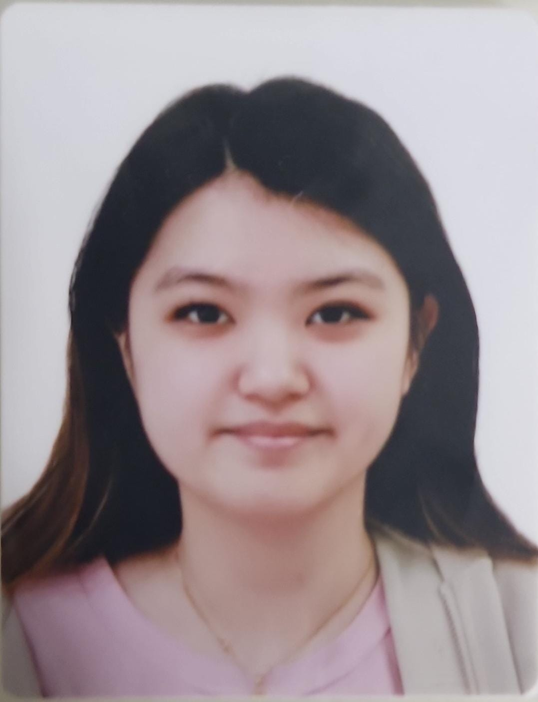
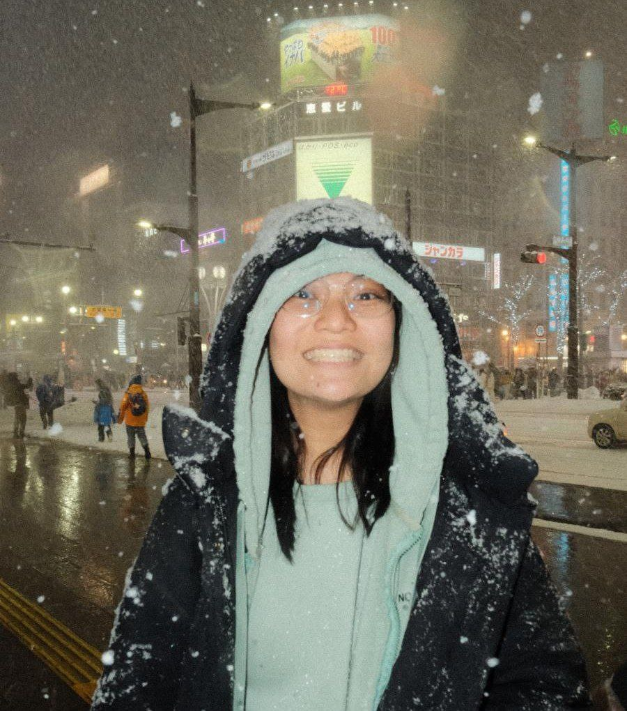
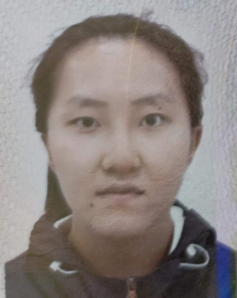

# About Us

We are a team based in the [School of Computing, National University of Singapore](http://www.comp.nus.edu.sg).

You can reach us at the email `seer[at]comp.nus.edu.sg`

## Project team

### Seevon Tan

[[github](https://github.com/Seethevon)]
[[portfolio](team/johndoe.md)]

* Role: Team Lead

### Amber Tan

[[github](http://github.com/ambertan77)]
[[portfolio](team/johndoe.md)]

* Role: Developer
* Responsibilities: UI

### Brian Goh

[[github](http://github.com/minnibb)] [[portfolio](team/johndoe.md)]

* Role: Developer
* Responsibilities: Data

### Li Yaner

[[github](http://github.com/liy722)]
[[portfolio](team/johndoe.md)]

* Role: Developer
* Responsibilities: Dev Ops + Threading
