# ClassHive User Guide

## :rotating_light: ATTENTION ALL TEACHERS! :rotating_light:
Introducing ClassHive, a **desktop app for managing all your 
school contacts**! ClassHive is a fast and easy to use app that helps you keep track of all the people you will need to 
contact, including colleagues, parents and students. In ClassHive, instead of having to click many buttons, you can 
simply type in commands to access any function! Let's now explore the different features that were built just for you! :rocket:

<!-- * Table of Contents -->
<page-nav-print />

--------------------------------------------------------------------------------------------------------------------

## 🚀 Let's get you started!

Getting started with ClassHive is easy! Just follow these steps:
1. Check your Java Version
    * To use ClassHive, you need Java `17` or above installed in your Computer.<br>
    * ❗**Mac users:** If you're unsure, follow [this guide](https://se-education.org/guides/tutorials/javaInstallationMac.html) to set it up.

2. Download ClassHive
    * Click [here](https://github.com/AY2425S2-CS2103T-F13-4/tp/releases) to download the latest version of ClassHive (`.jar` file).

3. Choose where to keep ClassHive
    * Move the downloaded file to a folder where you'd like to store ClassHive (e.g., "Documents" or "Desktop").

4. Open ClassHive
    * On Windows
      * Open the folder where you saved the file.
      * Hold **Shift**, right-click in the folder, and select "Open command window here" (or "Open PowerShell window here").
      * Type the following command and press **Enter**: <br>
      ```sh
        java -jar ClassHive.jar
      ```
    * On Mac
      * Open **Terminal** (you can find it using spotlight search, `Command (⌘) + Space`).
      * Type `cd ` (followed by a space), then **drag and drop** the folder where you saved ClassHive into the Terminal window.
      * Press **Enter**, then type:
       ```sh
        java -jar ClassHive.jar
      ```
       * Press **Enter** again. <br>

5. Start using ClassHive!
      * After a few seconds, the ClassHive window should appear, ready to help you manage your contacts easily.
      * It should look like this. <br>
   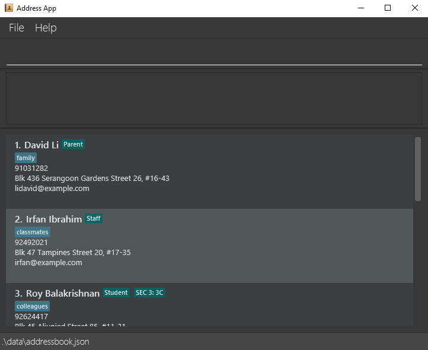

6. Refer to the [Features](#features) below for details of each command.

--------------------------------------------------------------------------------------------------------------------

## Features

<box type="tip" seamless>

It will be useful to know some information about the command format before getting started on the features!

**Here are some notes about the command format:**<br>

* Words in `UPPER_CASE` are the parameters to be supplied by the user.<br>
  e.g. in `add n/NAME`, `NAME` is a parameter which can be used as `add n/John Doe`.

* Items in square brackets are optional.<br>
  e.g `n/NAME [t/TAG]` can be used as `n/John Doe t/friend` or as `n/John Doe`.

* Items with `…`​ after them can be used multiple times including zero times.<br>
  e.g. `[t/TAG]…​` can be used as ` ` (i.e. 0 times), `t/friend`, `t/friend t/family` etc.

* Parameters can be in any order.<br>
  e.g. if the command specifies `n/NAME p/PHONE_NUMBER`, `p/PHONE_NUMBER n/NAME` is also acceptable.

* Extraneous parameters for commands that do not take in parameters (such as `help`, `list`, `exit` and `clear`) will be ignored.<br>
  e.g. if the command specifies `help 123`, it will be interpreted as `help`.

* If you are using a PDF version of this document, be careful when copying and pasting commands that span multiple lines as space characters surrounding line-breaks may be omitted when copied over to the application.
</box>

### Viewing help : `help`

Help is always near when using ClassHive! At any point in time, if you need instructions on how to use the app, 
type `help`.


Format: `help`

<box type="tip" seamless>

  **Tip**: You can also access help window by clicking on F1 or the help menu on the top left.
</box>

### Clearing all entries : `clear`

When you first download ClassHive, you might want to use the `clear` command to ensure you're starting with a
fresh database. The `clear` command allows you to remove all contacts from ClassHive with a single command.

_Before clearing the entries:_
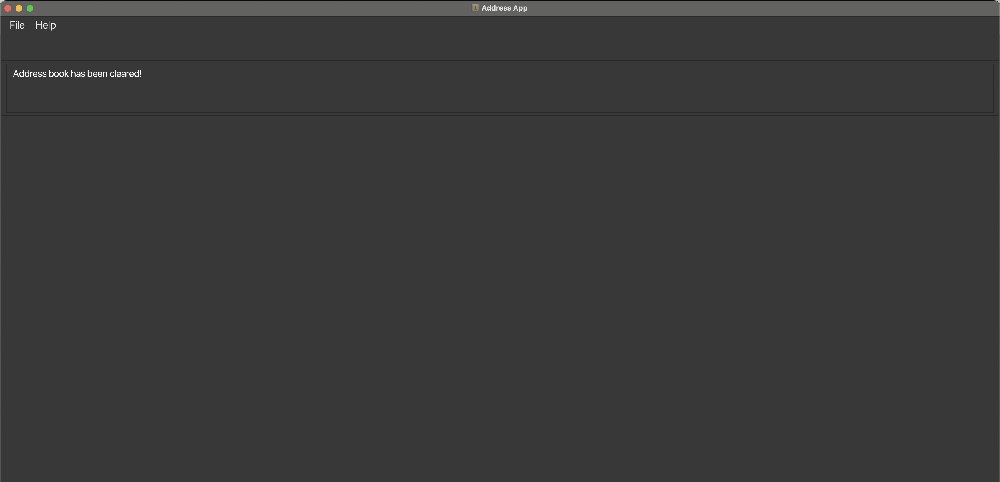
_After clearing the entries:_
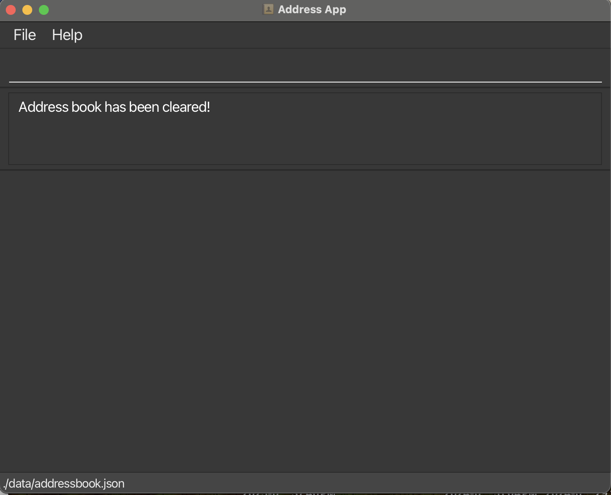

Format: `clear`

<box type="warning" seamless>

**Caution:**
This will remove ALL your contacts from ClassHive. Consider backing up your data before clearing (see FAQ section
on transferring data).
</box>

### Adding a contact: `add`

To make ClassHive ready for your personal use, add contacts into the app using the `add` command!

_Before adding the new contact:_
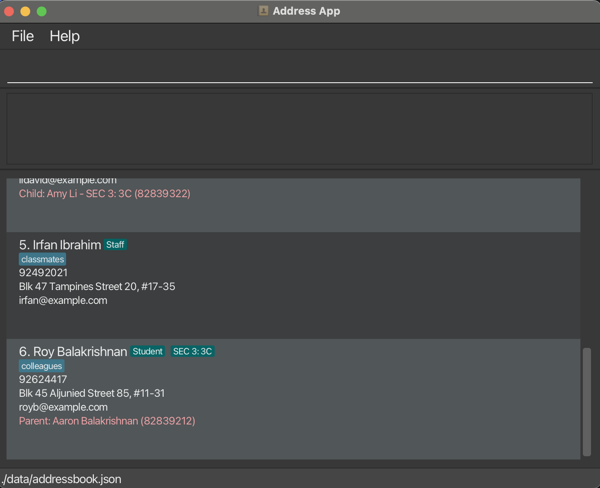
_After adding the new contact:_
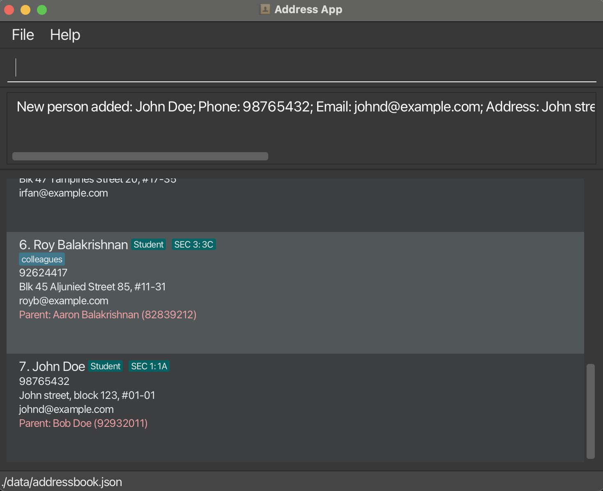

Format: 
- For adding Students: `add n/NAME p/PHONE_NUMBER e/EMAIL a/ADDRESS [t/TAG]… r/Student g/GRADE c/CLASS rn/PARENT'S_NAME rp/PARENT'S_PHONE​`
- For adding Parents: `add n/NAME p/PHONE_NUMBER e/EMAIL a/ADDRESS [t/TAG]… r/Parent g/CHILD'S_GRADE c/CHILD'S_CLASS rn/CHILD'S_NAME rp/CHILD'S_PHONE​`
- For adding Staffs/Colleagues: `add n/NAME p/PHONE_NUMBER e/EMAIL a/ADDESS [t/TAG]… r/Staff​`
<box type="info" seamless>

**Note:** 
- A contact can have any number of tags (including 0).
- The role of each contact must be either a "Student", "Staff" or "Parent" (roles are not case-sensitive).
- Only grades from Primary 1 to 6 and Secondary 1 to 5 are currently supported.
- For Staff contacts, do not add the grade, class, family member's name and family member's phone number.
</box>

Examples:
* `add n/John Doe p/98765432 e/johnd@example.com a/John street, block 123, #01-01 r/Student g/Sec 1 c/1A rn/Bob Doe rp/92932011`
* `add n/Bob Doe p/92932011 e/bobd@example.com a/John street, block 123, #01-01 r/Parent rn/John Doe rp/98765432 g/Sec 1 c/1A`
* `add n/Betsy Crowe t/friend e/betsycrowe@example.com a/Serangoon Avenue 2 p/12345678 r/Staff`

### Editing a contact : `edit`

If a contact's information has changed, simply use the `edit` command to change the contact's details. 

_Before editing the second contact in the list:_

_After editing the second contact in the list:_


Format: `edit INDEX [n/NAME] [p/PHONE] [e/EMAIL] [a/ADDRESS] [t/TAG]…​`

<box type="info" seamless>

**Note:**
* Edits the contact at the specified `INDEX`. The index refers to the index number shown in the displayed contact list. The index **must be a positive integer** 1, 2, 3, …​
* At least one of the optional fields must be provided.
* Existing values will be updated to the input values.
* When editing tags, the existing tags of the contact will be removed i.e adding of tags is not cumulative.
* You can remove all the contact’s tags by typing `t/` without specifying any tags after it.
* If you are changing the role to `Staff`, make sure that the fields `[g/GRADE]`, `[c/CLASS]`, `[rn/RELATIVE'S_NAME]` and
  `[rp/RELATIVE'S_PHONE]` are not included. 
* If you are changing the role to `Student` or `Parent`, make sure that the fields `[g/GRADE]`, `[c/CLASS]`, `[rn/RELATIVE'S_NAME]` and
  `[rp/RELATIVE'S_PHONE]` are included.
    </box>

Examples:
*  `edit 1 p/91234567 e/johndoe@example.com` Edits the phone number and email address of the 1st contact to be `91234567` and `johndoe@example.com` respectively.
*  `edit 2 n/Betsy Crower t/` Edits the name of the 2nd contact to be `Betsy Crower` and clears all existing tags.

### Deleting a contact : `delete`

As you use ClassHive, there may be some contacts that will leave the school. Since you no longer need to contact them, 
you can use the `delete` command to delete their information, ensuring ClassHive remains uncluttered with unnecessary information.

_Before deleting the old contact:_

_After deleting the old contact:_


Format: `delete n/NAME p/PHONE_NUMBER`
<box type="info" seamless>

**Note:**
* Deletes the contact with the specified `NAME` and `PHONE_NUMBER`.
* The contact specified in the command must already be a contact in the app.
  </box>

Examples:
* `delete n/Betsy Crowe p/12345678` deletes `Betsy Crowe` with the phone number `12345678` from the app.

### Adding note to a contact : `note`

As you add more contacts into ClassHive, you might want to remember important details about them. The `note` command 
allows you to add this information to specific contacts for easy reference later.

_Before adding a note to the first contact in the list:_
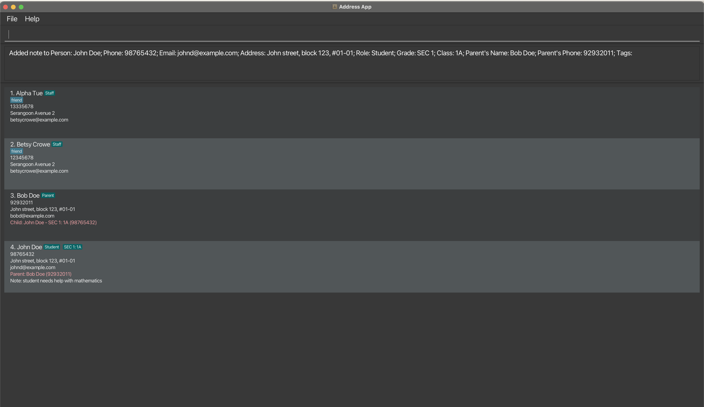
_After adding a note to the first contact in the list:_
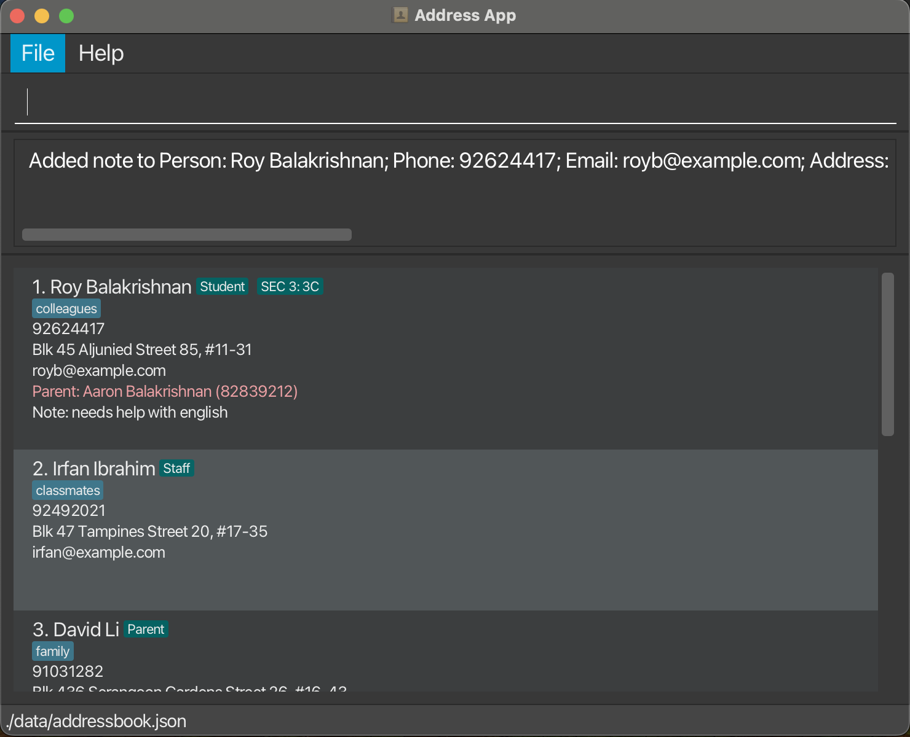

Format: `note INDEX nt/NOTE`

<box type="info" seamless>

**Note:**
* The INDEX refers to the index number shown in the displayed contact list.
* The index must be a positive integer (1, 2, 3, ...).
* Any existing note for the contact will be replaced by the new note.
  </box>

Examples:
* `note 1 nt/student needs help with English` Adds a note about academic needs to the 1st contact in the list.
* `note 3 nt/prefers to be contacted after 5pm` Adds a note about contact preferences to the 3rd contact.

### Finding contacts by name or phone number: `find`

The `find` command allows you to search for people by either their name or phone number, and handles partial matches.

Format:
- For searching name: `find KEYWORD [MORE_KEYWORDS]` <br>
- For searching phone number: `find NUMBER`

<box type="info" seamless>

**Note:** 
* The search is case-insensitive. e.g `hans` will match `Hans`.
* The order of the keywords does not matter. e.g. `Hans Bo` will match `Bo Hans`.
* Partial words/numbers will be matched e.g. `Han` will match with `Hans` or '9876' will match with '98765432'.
</box>

Examples:
* `find 9876` returns `987665432`, `97654678` and `90873648`
* `find John` returns `Johnny Lee` and `John Doe`
* `find al` returns `Roy Balakrishnan` and `Alex Yeoh`<br>
  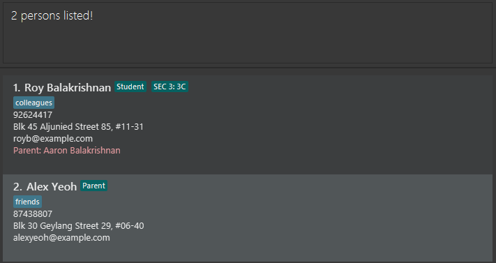

### Listing all contacts : `list`

Shows a list of all contacts in ClassHive.

Format: `list`

### Sorting contacts : `sort`

As a teacher managing multiple classes, your contact list will eventually get larger over time. If you want to keep your 
ClassHive contacts organized in a logical order, the `sort` command lets you arrange your contacts alphabetically by name 
or chronologically by when they were added, making it easier to scan through your list.

_Before sorting by contacts' names in descending order:_
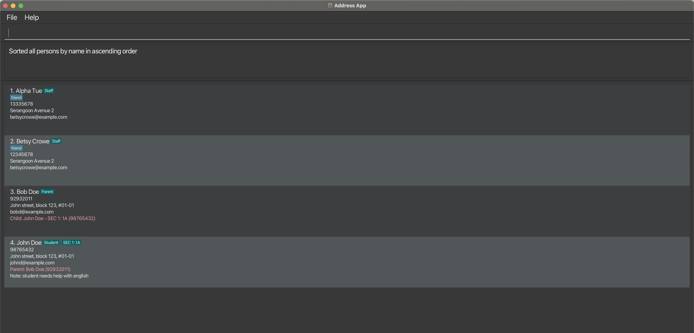
_After sorting by contacts' names in descending order:_
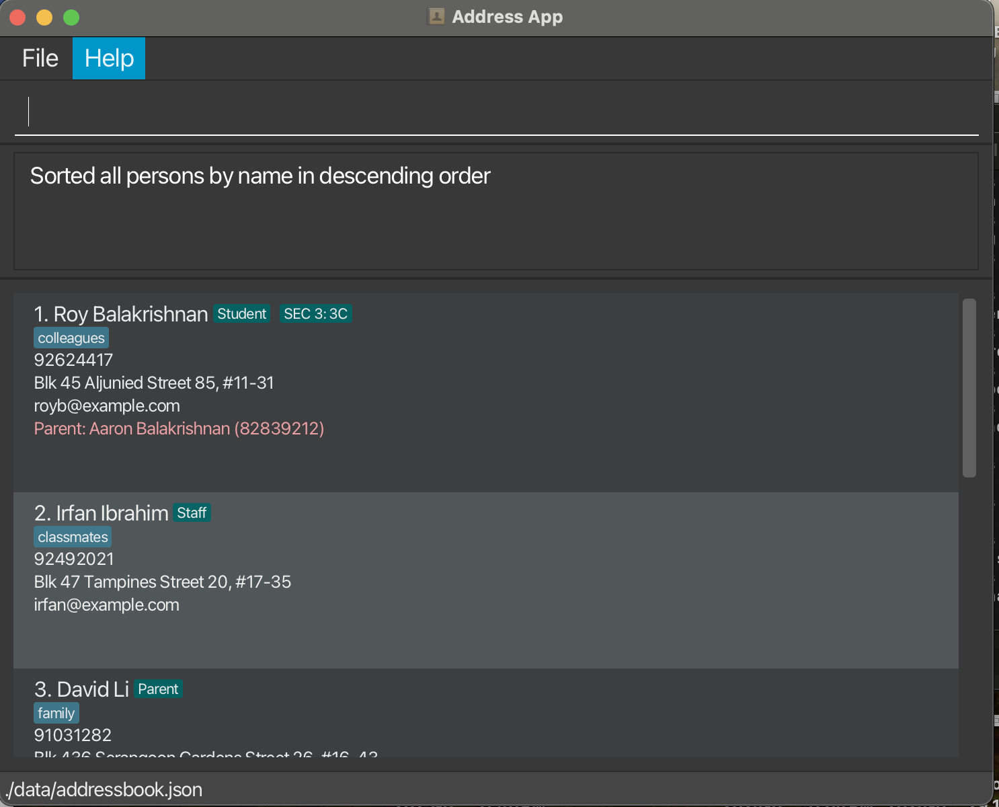

Format: `sort by/[FIELD] [ORDER]`
<box type="tip" seamless>

**Note:**
- Sorts the contacts based on the specified `FIELD` (name or date) and `ORDER` (asc or desc)
- `FIELD` can be either `name` or `date` (referring to when the contact was added)
- `ORDER` can be either `asc` (ascending) or `desc` (descending)
</box>

Examples:
* `sort by/name asc` sorts all contacts alphabetically by name from A to Z
* `sort by/name desc` sorts all contacts alphabetically by name from Z to A
* `sort by/date asc` sorts all contacts from oldest to newest added
* `sort by/date desc` sorts all contacts from newest to oldest added

<box type="tip" seamless>

**info:** Simply typing `sort` without any parameters will sort contacts alphabetically by name from A to Z.
</box>

### Grouping contacts : group

Filters and groups contacts by a specific role.

**Format:**  
`group by CATEGORY CRITERIA`

* **Supported category**:
    - `ROLE`/`CLASS`/`GRADE`/`FAVOURITE`

* **Supported criteria**:
    - `Parent`/`Student`/`Staff`  
    - `pri 1 ~ pri 6`/`sec 1 ~ sec 5`

* **Example: `group by ROLE Parent`**

<box type="info" seamless>

**Note**:
1. **Strict format**:
    - Category and criteria must be separated by a space.
    - Values are case-insensitive (e.g., `Parent` = `parent`).

2. **Validation rules**:
    - Role: Only `Parent`, `Student`, `Staff`.
    - Grade: Only `pri 1 ~ pri 6`/`sec 1 ~ sec 5`
    
3. Non-matching contacts will be hidden from view.
   </box>

**Examples**:
1. `group by ROLE student`   
   *Shows all contacts with the **Student** role.*


### Favourite contacts: `favourite`

The `favourite` command allows you to mark a contact as a favourite so that you can easily identify them later or retrieve them quickly when needed.

Format : `favourite INDEX`
<box type="info" seamless>

**Note:**
* The `INDEX` refers to the index number shown in the displayed contact list.
* The index **must be a positive integer** 1, 2, 3, …
* To **unmark** a contact as favourite, simply mark them as favourite again. This toggles the favourite status.
</box>

**Examples**:
* `favourite 1` Marks the first contact on the list as favourite.
  
* `favourite 1` **AGAIN**, unfavourite the first contact on the list.
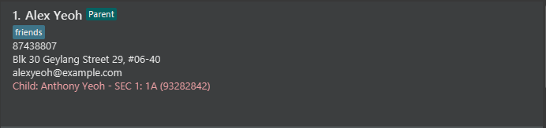

### Exiting the program : `exit`

After you have finished updating your contacts, you will want to safely close ClassHive. The `exit` command allows you to
properly shut down the application, ensuring all changes are saved.

Format: `exit`

### Saving the data

ClassHive data are saved in the hard disk automatically after any command that changes the data. There is no need to save manually.

### Editing the data file

ClassHive data are saved automatically as a JSON file `[JAR file location]/data/addressbook.json`. Advanced users are welcome to update data directly by editing that data file.

<box type="warning" seamless>

**Caution:**
If your changes to the data file makes its format invalid, ClassHive will discard all data and start with an empty data file at the next run.  Hence, it is recommended to take a backup of the file before editing it.<br>
Furthermore, certain edits can cause the ClassHive to behave in unexpected ways (e.g., if a value entered is outside the acceptable range). Therefore, edit the data file only if you are confident that you can update it correctly.
</box>

### Archiving data files `[coming in v2.0]`

_Details coming soon ..._


### Ungrouping contacts : ungroup
ungroup contacts
**Format:**  
`ungroup`


* **Example: `ungroup`**

**Examples**:
1. `ungroup`   
   *Showing all contacts (no grouping).*

---

--------------------------------------------------------------------------------------------------------------------

## FAQ

**Q**: How do I transfer my data to another Computer?<br>
**A**: Install the app in the other computer and overwrite the empty data file it creates with the file that contains the data of your previous AddressBook home folder.

--------------------------------------------------------------------------------------------------------------------

## Known issues

1. **When using multiple screens**, if you move the application to a secondary screen, and later switch to using only the primary screen, the GUI will open off-screen. The remedy is to delete the `preferences.json` file created by the application before running the application again.
2. **If you minimize the Help Window** and then run the `help` command (or use the `Help` menu, or the keyboard shortcut `F1`) again, the original Help Window will remain minimized, and no new Help Window will appear. The remedy is to manually restore the minimized Help Window.
3. **Adding more than one family member is currently not supported.** Only one family member can be added per contact. Currently, the developer team is working to allow support for the addition of more than one child or parent!

--------------------------------------------------------------------------------------------------------------------

## 💻 Command summary


| Action       | Format, Examples                                                                                                                                                                                                                                        |
|--------------|---------------------------------------------------------------------------------------------------------------------------------------------------------------------------------------------------------------------------------------------------------|
| **Help**     | `help`                                                                                                                                                                                                                                                  |
| **Clear**    | `clear`                                                                                                                                                                                                                                                 |
| **Add**      | `add n/NAME p/PHONE_NUMBER e/EMAIL a/ADDRESS [t/TAG]… r/Student g/GRADE c/CLASS rn/KIN'S_NAME rp/KIN'S_PHONE` <br> e.g., `add n/John Doe p/98765432 e/johnd@example.com a/John street, block 123, #01-01 r/Student g/Sec 1 c/1A rn/Bob Doe rp/92932011` |
| **Delete**   | `delete n/NAME p/PHONE`<br> e.g., `delete n/Betsy Crowe p/12345678`                                                                                                                                                                                     |
| **Edit**     | `edit INDEX [n/NAME] [p/PHONE_NUMBER] [e/EMAIL] [a/ADDRESS] [t/TAG]…`<br> e.g.,`edit 2 n/James Lee e/jameslee@example.com`                                                                                                                              |
| **Note**     | `note INDEX n/NOTE`<br> e.g., `note 1 nt/student needs extra help with Mathematics`                                                                                                                                                                     |
| **Find**     | `find KEYWORD [MORE_KEYWORDS]`<br> e.g., `find James Tan` <br> `find NUMBER` <br> e.g, `find 98765432`                                                                                                                                                  |
| **List**     | `list`                                                                                                                                                                                                                                                  |
| **Sort**     | `sort by/[FIELD] [ORDER]`<br> e.g., `sort by/name asc`, `sort by/date desc`          |
| **Group**   | `group by [category] [criteria]`<br>e.g., `group by ROLE student`, `group by CLASS 1A, group by FAVOURITE, group by GRADE pri 1`                                                                                                                        |
| **Ungroup** | `ungroup`                                                                                                                                                                                     |
| **Favourite** | `favourite [INDEX]`<br> e.g., `favourite 1                                                                                                                                                                                                             |
| **Exit**     | `exit`                                                                                                                                                                                                                                                  |

