# ClassHive User Guide

## :rotating_light: ATTENTION ALL TEACHERS! :rotating_light:
Introducing ClassHive, a **desktop app for managing all your school contacts**! 
ClassHive is a fast and easy to use app that helps you keep track of all the people you will need to 
contact, including colleagues, parents and students. In ClassHive, instead of having to click many buttons, you can 
simply type in commands to access any function! Let's now explore the different features that were built just for you! :rocket:

<!-- * Table of Contents -->
<page-nav-print />

--------------------------------------------------------------------------------------------------------------------

## 🚀 Let's get you started!

Getting started with ClassHive is easy! Just follow these steps:
1. Check your Java Version
    * To use ClassHive, you need Java `17` or above installed in your Computer.<br>
    * ❗**Mac users:** If you're unsure, follow [this guide](https://se-education.org/guides/tutorials/javaInstallationMac.html) to set it up. <br>
<br>

2. Download ClassHive
    * Click [here](https://github.com/AY2425S2-CS2103T-F13-4/tp/releases) to download the latest version of ClassHive (`.jar` file). <br>
<br>

3. Choose where to keep ClassHive
    * Move the downloaded file to a folder where you'd like to store ClassHive (e.g., "Documents" or "Desktop"). <br>
<br>

4. Open ClassHive
    * On Windows
      * Open the folder where you saved the file.
      * Hold **Shift**, right-click in the folder, and select "Open command window here" (or "Open PowerShell window here").
      * Type the following command and press **Enter**: <br>
      ```sh
        java -jar ClassHive.jar
      ```
      
    * On Mac
      * Open **Terminal** (you can find it using spotlight search, `Command (⌘) + Space`).
      * Type `cd ` (followed by a space), then **drag and drop** the folder where you saved ClassHive into the Terminal window.
      * Press **Enter**, then type:
       ```sh
        java -jar ClassHive.jar
       ```
       * Press **Enter** again. <br>
<br>

5. Start using ClassHive!
      * After a few seconds, the ClassHive window should appear, ready to help you manage your contacts easily.
      * It should look like this! It will contain some sample data. <br>
        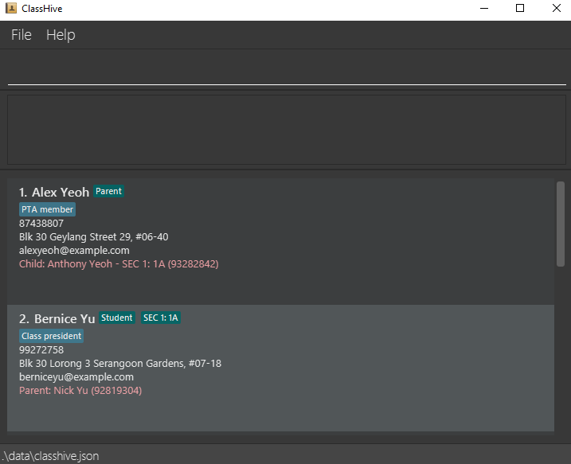 <br>

<br>

6. Refer to the [Features](#features) below for details of each command. <br>
7. 💡 If you're unfamiliar with using commands in a command-line interface (CLI), check out the [CLI Tutorial](#cli-tutorial) to get comfortable before diving in! <br>
--------------------------------------------------------------------------------------------------------------------

## CLI Tutorial
If you've never used a CLI before don’t worry! This short tutorial will walk you through the basics, and you’ll be managing your contacts like a pro in no time!
<br>

### Getting Familiar with the Interface
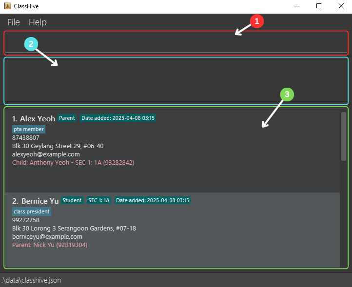 <br>

1️⃣ #r#Command box## <br>
  * This is where users type their commands to interact with ClassHive. <br>
  
2️⃣ #c#Result Display Box## <br>
  * Displays messages about the executed command. <br>
  
3️⃣ #g#Contact List Panel## <br>
  * Shows the list of contacts stored in ClassHive, including their details. <br>

<br>

### Try Your First Commands!
Now that you're familiar with the interface, let's try executing some commands!

#### Command 1: ⭐ Favourite

1️⃣ Type the following command into the **Command Box**:
<box>
favourite 1
</box>

2️⃣ Press **Enter**. <br>
3️⃣ You should see this. <br>
   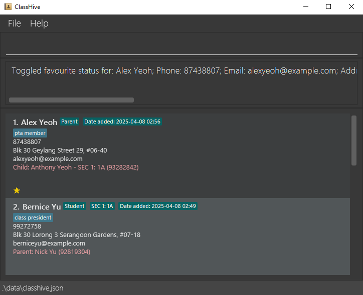 
<br>
<br>
#### Command 2: ➕ Add

1️⃣ Type the following command into the **Command Box**:
<box>
add n/Betsy Crowe t/friend e/betsycrowe@example.com a/Serangoon Avenue 2 p/12345678 r/Staff
</box>

2️⃣ Press **Enter**. <br>
3️⃣ Scroll down the **Contact List Panel**. <br>
4️⃣ You should see this. <br>
   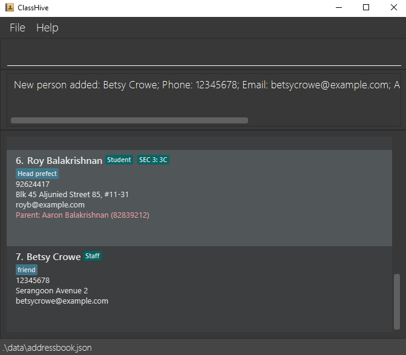 
<br>
<br>

#### Command 3: 🗑️ Delete

1️⃣ Type the following command into the **Command Box**:
<box>
delete n/Betsy Crowe p/12345678
</box>

2️⃣ Press **Enter**. <br>
3️⃣ Scroll down the **Contact List Panel**. <br>
4️⃣ You should see this. <br>
   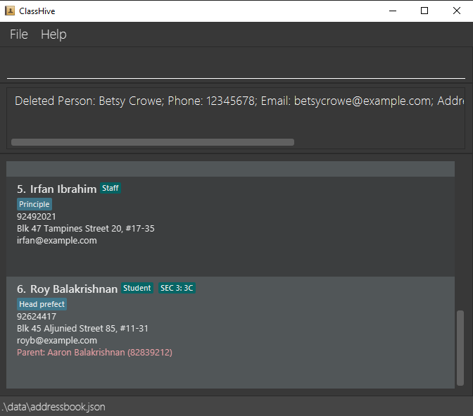 
<br>
<br>

#### 🎊 Congratulations!

You have completed your first few commands in ClassHive!🥳 <br>
You're now officially a **ClassHive Pro**. Head over to the [Features](#features) section to explore more commands ClassHive has to offer.

--------------------------------------------------------------------------------------------------------------------
## Features

<box type="tip" seamless>

It will be useful to know some information about the command format before getting started on the features!

**Here are some notes about the command format:**<br>

* Words in `UPPER_CASE` are the inputs for you to key in.<br>
  e.g. in `add n/NAME`, `NAME` is to be filled in by you. If `NAME` is `John Doe`, then type into the command box `add n/John Doe`.

* Items in square brackets are optional to specify.<br>
  e.g `n/NAME [t/TAG]` can be used as `n/John Doe t/friend` or as `n/John Doe`.

* Items with `…`​ after them can be used zero, one or more times.<br>
  e.g. `[t/TAG]…​` can be used as ` ` (i.e. 0 times), `t/friend`, `t/friend t/family` etc.

* Parameters can be specified in any order.<br>
  e.g. if the command needs your input for a contact's name and phone number, `n/NAME p/PHONE_NUMBER`, `p/PHONE_NUMBER n/NAME` is also acceptable.

* Commands that do not take in user inputs (such as `help`, `list`, `exit` and `clear`) ignores the addition of any extra inputs.<br>
  e.g. if the command specifies `help 123`, it will be interpreted as `help`.

* All commands are case-sensitive, so make sure to type in the command in **small letters**. <br>
  e.g. use `add` instead of `ADD` or `Add`
</box>

You can refer to the [Command Summary](#-command-summary) and the [Prefix Summary](#prefix-summary) to see a summary of all commands and their related prefixes.
<box type="warning" seamless>

**Caution:** If you are using a PDF version of this document, be careful when copying and pasting commands that span multiple lines as space characters surrounding line-breaks may be omitted when copied over to the application.
</box>

### Viewing help : `help`

Help is always near when using ClassHive! At any point in time, if you need instructions on how to use the app, 
type `help`.

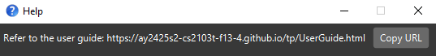

**Format:** `help`

<box type="tip" seamless>

  **Tip**: You can also access help window by clicking on F1 or the help menu on the top left bar.
</box>
<br>

### Clearing all entries : `clear`

When you first download ClassHive, you might want to use the `clear` command to ensure you're starting with a
fresh database. The `clear` command allows you to remove all contacts from ClassHive with a single command.

**Format:** `clear`

<box type="warning" seamless>

**Caution:**
This is an irreversible action that will remove ALL your contacts from ClassHive.
Consider backing up your data before clearing (see FAQ section on transferring data).
</box>
<br>
<div style="display: flex; justify-content: space-between; text-align: center; width: 100%;">
  <div style="width: 48%;">
    <p>Before clearing the entries:</p>
    
  </div>
  <div style="width: 48%;">
    <p>After clearing the entries:</p>
    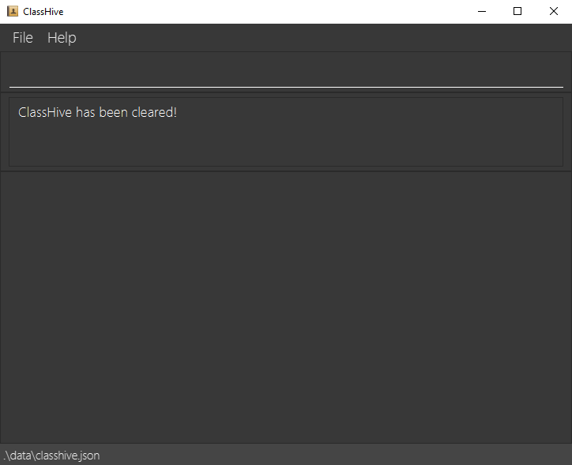
  </div>
</div>
<br>
<br>

### Adding a contact: `add`

To make ClassHive ready for your personal use, add contacts into the app using the `add` command!

**Format:** 
- For adding Students: `add n/NAME p/PHONE_NUMBER e/EMAIL a/ADDRESS [t/TAG]… r/Student g/GRADE c/CLASS rn/PARENT'S_NAME rp/PARENT'S_PHONE​`
- For adding Parents: `add n/NAME p/PHONE_NUMBER e/EMAIL a/ADDRESS [t/TAG]… r/Parent g/CHILD'S_GRADE c/CHILD'S_CLASS rn/CHILD'S_NAME rp/CHILD'S_PHONE​`
- For adding Staffs/Colleagues: `add n/NAME p/PHONE_NUMBER e/EMAIL a/ADDESS [t/TAG]… r/Staff​`
<box type="info" seamless>

**Note:** <br>
- A contact can have any number of tags (including 0).
- The role of each contact must be either a "Student", "Staff" or "Parent" (roles are not case-sensitive).
- Only grades from Primary 1 to 6 and Secondary 1 to 5 are currently supported.
- For Staff contacts, do not add the grade, class, family member's name and family member's phone number.
- Phone numbers must be an 8-digit Singapore number, without specification of the country code. Ensure that there are also no spaces in the middle of the phone number. 
</box>
  
<box type="tip" seamless>

**Tip:** As the phone number field is compulsory, if a student does not have a contact number, you can add his or her parent's phone number instead!
  </box>

**Examples:**
* `add n/John Doe p/98765432 e/johnd@example.com a/John street, block 123, #01-01 r/Student g/Sec 1 c/1A rn/Bob Doe rp/92932011` adds the student `John Doe` into ClassHive. 
* `add n/Bob Doe p/92932011 e/bobd@example.com a/John street, block 123, #01-01 r/Parent rn/John Doe rp/98765432 g/Sec 1 c/1A` adds the parent `Bob Doe` into ClassHive.
* `add n/Jamie Goh p/98128281 e/jamie@example.com a/Jamie street, block 123, #01-02 r/Student g/Pri 2 c/2C rn/Joseph Goh rp/98128272` adds the student `Jamie Goh` into ClassHive.
* `add n/Betsy Crowe t/boss e/betsycrowe@example.com a/Serangoon Avenue 2 p/12345678 r/Staff` adds the staff member `Betsy Crowe` into ClassHive. 

**Expected output:**
* Expected message displayed in the output box: `New person added: CONTACT`, where `CONTACT` reflects the details of the contact added.
  For example, upon running the command in the first example shown above, the expected output will be 
  `New person added: John Doe; Phone: 98765432; Email: johnd@example.com; Address: John street, block 123, #01-01; Role: Student; Grade: SEC 1; Class: 1A; Parent's Name: Bob Doe; Parent's Phone: 92932011; Tags: `
* The new contact will be added to the bottom of the list of contacts. Scroll to the bottom to see it!
<br>

### Editing a contact : `edit`

If a contact's information has changed, simply use the `edit` command to change the contact's details.

**Format:** `edit INDEX [n/NAME] [p/PHONE] [e/EMAIL] [a/ADDRESS] [t/TAG]…​`

<box type="info" seamless>

**Note:** <br>
* Edits the contact at the specified `INDEX`, which refers to the index number shown in the displayed contact list. The index **must be a positive integer** 1, 2, 3, …​
* At least one of the optional fields must be provided.
* If you are changing the role to `Staff`, make sure that the fields `[g/GRADE]`, `[c/CLASS]`, `[rn/RELATIVE'S_NAME]` and
  `[rp/RELATIVE'S_PHONE]` are not included. 
* If you are changing the role to `Student` or `Parent`, make sure that the fields `[g/GRADE]`, `[c/CLASS]`, `[rn/RELATIVE'S_NAME]` and
  `[rp/RELATIVE'S_PHONE]` are included.
    </box>

<box type="tip" seamless>

**Tip:** <br>
* You can remove all the contact’s tags by typing `t/` without specifying any tags after it.
* After running the edit command, the existing contact will reflect the new fields you have input.
    </box>

<box type="warning" seamless>

**Caution:** When editing tags, all existing tags of the contact will be removed and replaced with the new tag.
    </box>

**Examples:**
*  `edit 3 n/Charlie Olive p/98989898` edits the name and phone number of the 3rd contact to be `Charlie Olive` and `98989898` respectively. 
*  `edit 2 n/Betsy Crower t/` edits the name of the 2nd contact to be `Betsy Crower` and clears all existing tags.

**Expected output:**
* Expected message displayed in the output box: `Edited Person: CONTACT`, where `CONTACT` reflects the details of the contact edited.
  For example, running the command in the first example above results in the output message `Edited Person: Charlie Olive; Phone: 98989898; Email: charlotte@example.com; Address: Blk 11 Ang Mo Kio Street 74, #11-04; Role: Staff; Tags: [mentor]`.
* The edited details will also be reflected on ClassHive, as shown in the images below:

<br>
<div style="display: flex; justify-content: space-between; text-align: center; width: 100%;">
  <div style="width: 48%;">
    <p>Before editing the 3rd contact:</p>
    
  </div>
  <div style="width: 48%;">
    <p>After editing the 3rd contact:</p>
    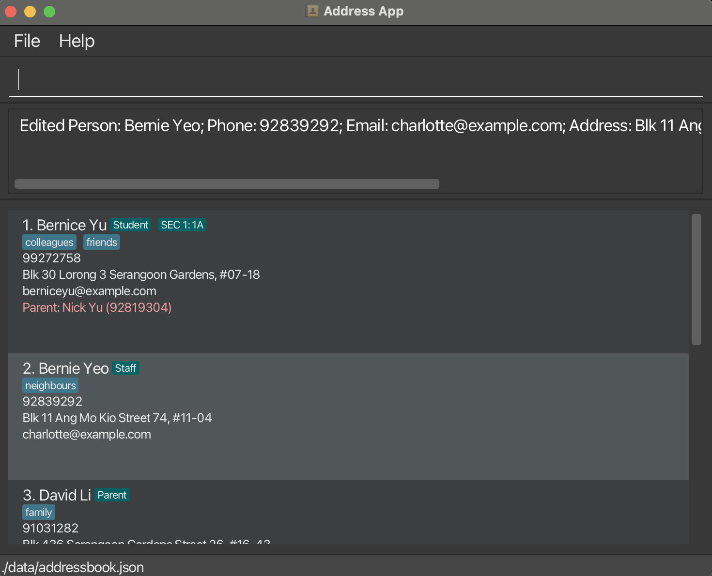
  </div>
</div>
<br>
<br>

### Deleting a contact : `delete`

As you use ClassHive, there may be some contacts that will leave the school. Since you no longer need to contact them, 
you can use the `delete` command to delete their information, ensuring ClassHive remains uncluttered with unnecessary information.

**Format:** `delete n/NAME p/PHONE_NUMBER`
<box type="info" seamless>

**Note:** <br>
* Deletes the contact with the specified `NAME` and `PHONE_NUMBER`.
* The contact specified in the command must already be a contact in the app.
  </box>

**Examples:**
* `delete n/John Doe p/98765432` deletes `John Doe` with the phone number `98765432` from the app.

**Expected output:**
* Expected message displayed in the output box: `Deleted Person: CONTACT`, where `CONTACT` reflects the details of the contact deleted. 
  For example, running the command in the example above will result in the output message `Deleted Person: John Doe; Phone: 98765432; Email: johnd@example.com; Address: John street, block 123, #01-01; Role: Student; Grade: SEC 1; Class: 1A; Parent's Name: Bob Doe; Parent's Phone: 92932011; Tags: `.
<br>

### Adding note to a contact : `note`

As you add more contacts into ClassHive, you might want to remember important details about them. The `note` command 
allows you to add this information to specific contacts for easy reference later.

**Format:** `note INDEX nt/NOTE`

<box type="info" seamless>

**Note:** <br>
* The INDEX refers to the index number shown in the displayed contact list.
* The index must be a positive integer (1, 2, 3, ...).
* Any existing note for the contact will be replaced by the new note.
  </box>

**Examples:**
* `note 3 nt/prefers to be contacted after 5pm` adds a note about contact preferences to the 3rd contact.
* `note 1 nt/student needs help with English` adds a note about academic needs to the 1st contact in the list.
  
**Expected output:**
* Expected message displayed in the output box: `Added note to Person: CONTACT`, where `CONTACT` reflects the details of the contact added.
  For example, upon running the command in the second example shown above, the expected output will be 
  `Added note to Person: Alex Yeoh; Phone: 87438807; Email: alexyeoh@example.com; Address: Blk 30 Geylang Street 29, #06-40; Role: Parent; Child's Name: Anthony Yeoh; Child's Phone: 93282842; Child's Grade: SEC 1; Child's Class: 1A; Tags: [pta member]`
* The added note will also be reflected in ClassHive, as shown in the image below.
  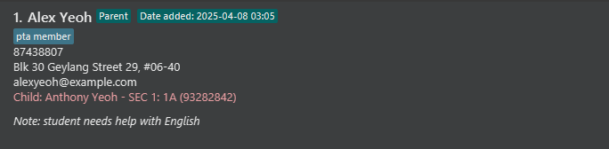
<br>

### Finding contacts by name or phone number: `find`

There will be times when you need to quickly locate someone by name or phone number, the `find` command helps you do just that!

**Format:**
- For searching name: `find KEYWORD [MORE_KEYWORDS]` <br>
- For searching phone number: `find NUMBER`

<box type="info" seamless>

**Note:** <br>
* The search is case-insensitive. e.g `hans` will match `Hans`.
* The order of the keywords does not matter. e.g. `Hans Bo` will match `Bo Hans`.
* Partial words/numbers will be matched e.g. `Han` will match with `Hans` or '9876' will match with '98765432'.
* If you search with **only numbers** (e.g., 12345), it will be treated as a **phone number** search.
* **Spaces** between numbers (e.g., 123 456) will be treated as a **name** search containing those numbers.
</box>

**Examples:**
* `find 9876` returns `98766543`, `97659876` and `90987648`
* `find John` returns `Johnny Lee` and `John Doe`
* `find al` returns `Roy Balakrishnan` and `Alex Yeoh`

**Expected output:**
* Expected message displayed in the output box: `[NUMBER] persons listed!`, where `NUMBER` reflects the number of contacts that match the keyword entered.
  For example, upon running the command in the third example shown above, the expected output will be 
  `2 persons listed!`
* The matching contacts will be displayed in ClassHive, as shown in the image below:
  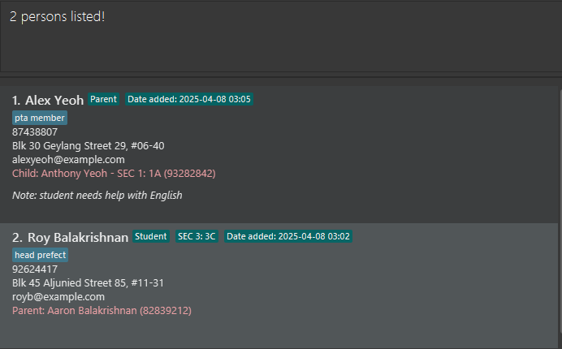
  <br>

### Listing all contacts : `list`

Shows a list of all contacts in ClassHive.

**Format:** `list`

**Expected output:**
* Expected message displayed in the output box: `Listed all persons`
* The full list of contacts will be displayed in the UI, regardless of the previous view or filters applied.
  <br>

### Sorting contacts : `sort`

As a teacher managing multiple classes, your contact list will eventually get larger over time. If you want to keep your 
ClassHive contacts organized in a logical order, the `sort` command lets you arrange your contacts alphabetically by name 
or chronologically by when they were added, making it easier to scan through your list.

**Format:** `sort by [FIELD] [ORDER]`

<box type="info" seamless>

**Note:** <br>
- Sorts the contacts based on the specified `FIELD` (name or date) and `ORDER` (asc or desc)
- `FIELD` can be either `name` or `date` (referring to when the contact was added)
- `ORDER` can be either `asc` (ascending) or `desc` (descending)
</box>

<box type="tip" seamless>

**Tip:** Simply typing `sort` without any parameters will sort contacts alphabetically by name from A to Z.
</box>

<box type="warning" seamless>

**Caution:** `sort` command can only be used on the **full contact list**. If you've recently used `find`, `group`,
or any other filter-based command, run `list` first to reset the view.
</box>

**Examples:**
* `sort by name asc` sorts all contacts alphabetically by name from A to Z
* `sort by name desc` sorts all contacts alphabetically by name from Z to A
* `sort by date asc` sorts all contacts from oldest to newest added
* `sort by date desc` sorts all contacts from newest to oldest added

**Expected output:**
* Expected message displayed in the output box: `Sorted all persons by [FIELD] in [ORDER] order`.
  For example, upon running the command in the second example shown above, the expected output will be 
  `Sorted all persons by name in descending order`
* The sorted contacts will also be reflected on ClassHive, as shown in the images below:
<br>
<div style="display: flex; justify-content: space-between; text-align: center; width: 100%;">
  <div style="width: 48%;">
    <p>Before any sorting is done:</p>
    
  </div>
  <div style="width: 48%;">
    <p>After sorting by contacts' names in descending order:</p>
    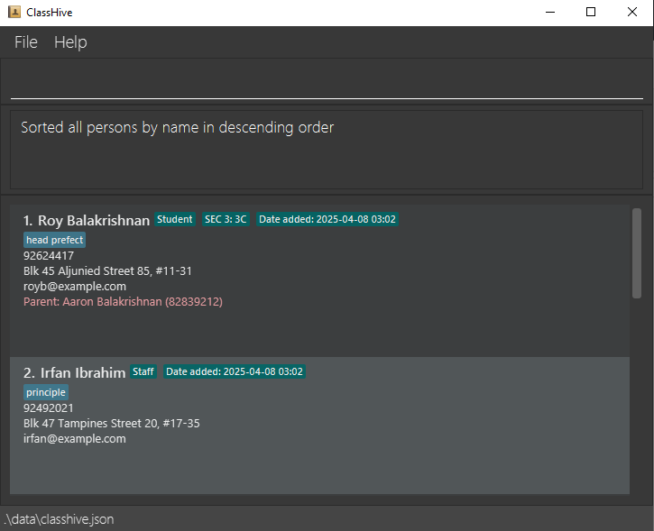
  </div>
</div>
<br>
<br>

### Grouping contacts : group

With the `group` command, you can organize your contacts into specific categories, helping you quickly find the people you're looking for. Whether it’s by their role, class, grade, or favorite status, you can filter and group your contacts to keep your list well-organized.

**Format**:  
`group by CATEGORY [CRITERIA]`


| Category      | Criteria                                                                                                                                                                                                                                      |
|--------------|---------------------------------------------------------------------------------------------------------------------------------------------------------------------------------------------------------------------------------------------------------|
| **Role**     | `Parent`, `Student`, `Staff`                                                                                                                                                                                                                   |
| **Class**     | **Any non-empty value**                                                                                                                                                                                                                       |
| **Grade**     | `pri 1` to `pri 6` or `sec 1` to `sec 5`                                                                                                                                                                                                      |
| **Favourite** | **No criteria needed**                                                                                                                                                                                                                        |
<box type="info" seamless>

**Note:** <br>
- Group handles only **one category** at a time.
- Values are case-insensitive (e.g., `Parent` = `parent`).
- Contacts that don't match will be hidden.
- Group by always operates on your full contact list, not just the currently displayed subset.
</box>

<box type="tip" seamless>

**Tip:** to clear any active group and show all contacts again, type `ungroup`.
</box>

**Examples:**
* `group by ROLE student` shows all students in your contact list. <br>
* `group by CLASS 2A` shows students and their parents from class 2A. <br>  
* `group by GRADE pri 4` shows all Primary 4 students and their parents. <br>
* `group by FAVOURITE` shows all contacts marked as favourite.

**Expected output:**
* Expected message displayed in the output box: `[NUMBER] persons listed!`, where `NUMBER` reflects the number of contacts that match the keyword entered.
  For example, upon running the command in the first example shown above, the expected output will be <br>
  `Results are grouped by: ROLE student` <br>
  `2 contacts found.`
*  You’ll see the grouped contacts reflected on ClassHive, as shown in the image below:
   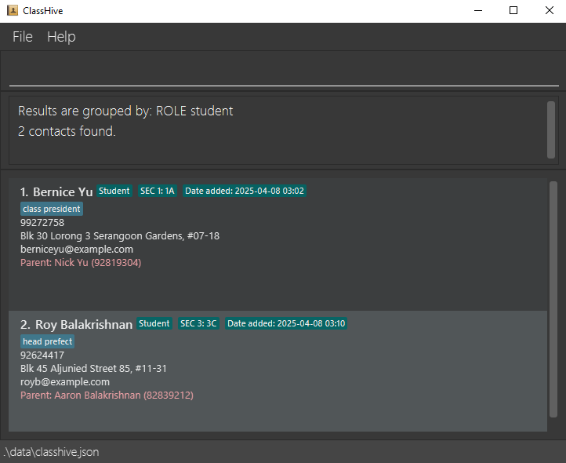
  
### Favourite contacts: `favourite`

The `favourite` command lets you mark important contacts as favourites, making it easy to find and highlight them later. Whether it's a key student, parent, or colleague, you can quickly access your favourite contacts whenever needed.

**Format:** `favourite INDEX`
<box type="info" seamless>

**Note:** <br>
* The `INDEX` refers to the index number shown in the displayed contact list.
* The index **must be a positive integer** 1, 2, 3, …
* To **unmark** a contact as favourite, simply mark them as favourite again. This toggles the favourite status.
</box>

**Examples**:
* `favourite 1` marks the first contact on the list as favourite.
* `favourite 1` **AGAIN**, unfavourite the first contact on the list.

**Expected output:**
* Expected message displayed in the output box: `Toggled favourite status for: [CONTACT]`, where `CONTACT` eflects the details of the contact whose favourite status was toggled.
  For example, upon running the command in the first example shown above, the expected output will be 
  `Toggled favourite status for: Alex Yeoh; Phone: 87438807; Email: alexyeoh@example.com; Address: Blk 30 Geylang Street 29, #06-40; Role: Parent; Child's Name: Anthony Yeoh; Child's Phone: 93282842; Child's Grade: SEC 1; Child's Class: 1A; Tags: [pta member]`
* The star icon will appear or disappear next to the contact in the list, depending on their updated favourite status. <br>
  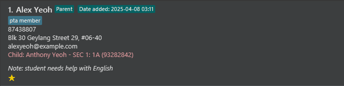

### Exiting the program : `exit`

After you have finished updating your contacts, you will want to safely close ClassHive. The `exit` command allows you to
properly shut down the application, ensuring all changes are saved.

**Format:** `exit`

### Saving the data

ClassHive data are saved in the hard disk automatically after any command that changes the data. There is no need to save manually.

### Editing the data file

ClassHive data are saved automatically as a JSON file `[JAR file location]/data/classhive.json`. Advanced users are welcome to update data directly by editing that data file.

<box type="warning" seamless>

**Caution:**
If your changes to the data file makes its format invalid, ClassHive will discard all data and start with an empty data file at the next run.  Hence, it is recommended to take a backup of the file before editing it.<br>
Furthermore, certain edits can cause the ClassHive to behave in unexpected ways (e.g., if a value entered is outside the acceptable range). Therefore, edit the data file only if you are confident that you can update it correctly.
</box>

--------------------------------------------------------------------------------------------------------------------

## FAQ

**Q**: How do I transfer my data to another Computer?<br>
**A**: Install the app in the other computer by following the instructions in the [Quick Start section](#-lets-get-you-started) 
and replace the empty data file it creates with the file that contains the data of your previous ClassHive home folder.

--------------------------------------------------------------------------------------------------------------------

## Known issues

1. **When using multiple screens**, if you move the application to a secondary screen, and later switch to using only the primary screen, the GUI will open off-screen. To fix this issue, delete the `preferences.json` file created by the application before running the application again.
2. **If you minimise the Help Window** and then run the `help` command (or use the `Help` menu, or the keyboard shortcut `F1`) again, the original Help Window will remain minimised, and no new Help Window will appear. To fix this issue, manually restore the minimised Help Window.

--------------------------------------------------------------------------------------------------------------------

## 💻 Command summary

| Action        | Format, Examples                                                                                                                                                                                                                                                                                                                                                                                                                                                                                                                                      |
|---------------|-------------------------------------------------------------------------------------------------------------------------------------------------------------------------------------------------------------------------------------------------------------------------------------------------------------------------------------------------------------------------------------------------------------------------------------------------------------------------------------------------------------------------------------------------------|
| **Help**      | `help`                                                                                                                                                                                                                                                                                                                                                                                                                                                                                                                                                |
| **Clear**     | `clear`                                                                                                                                                                                                                                                                                                                                                                                                                                                                                                                                               |
| **Add**       | `add n/NAME p/PHONE_NUMBER e/EMAIL a/ADDRESS [t/TAG]… r/Student g/GRADE c/CLASS rn/KIN'S_NAME rp/KIN'S_PHONE` <br> <br> Examples: <br> Adding students:`add n/John Doe p/98765432 e/johnd@example.com a/John street, block 123, #01-01 r/Student g/Sec 1 c/1A rn/Bob Doe rp/92932011` <br> Adding parents:`add n/Bob Doe p/92932011 e/bobd@example.com a/John street, block 123, #01-01 r/Parent rn/John Doe rp/98765432 g/Sec 1 c/1A` <br> Adding staff: `add n/Betsy Crowe t/boss e/betsycrowe@example.com a/Serangoon Avenue 2 p/12345678 r/Staff` |
| **Delete**    | `delete n/NAME p/PHONE`<br> e.g., `delete n/Betsy Crowe p/12345678`                                                                                                                                                                                                                                                                                                                                                                                                                                                                                   |
| **Edit**      | `edit INDEX [n/NAME] [p/PHONE_NUMBER] [e/EMAIL] [a/ADDRESS] [t/TAG]…`<br> e.g.,`edit 2 n/James Lee e/jameslee@example.com`                                                                                                                                                                                                                                                                                                                                                                                                                            |
| **Note**      | `note INDEX nt/NOTE`<br> e.g., `note 1 nt/student needs extra help with Mathematics`                                                                                                                                                                                                                                                                                                                                                                                                                                                                  |
| **Find**      | `find KEYWORD [MORE_KEYWORDS]`<br> e.g., `find James Tan` <br> `find NUMBER` <br> e.g, `find 98765432`                                                                                                                                                                                                                                                                                                                                                                                                                                                |
| **List**      | `list`                                                                                                                                                                                                                                                                                                                                                                                                                                                                                                                                                |
| **Sort**      | `sort by [FIELD] [ORDER]`<br> e.g., `sort by name asc`, `sort by date desc`                                                                                                                                                                                                                                                                                                                                                                                                                                                                           |
| **Group**     | `group by [category] [criteria]`<br>e.g., `group by ROLE student`, `group by CLASS 1A, group by FAVOURITE, group by GRADE pri 1`                                                                                                                                                                                                                                                                                                                                                                                                                      |
| **Ungroup**   | `ungroup`                                                                                                                                                                                                                                                                                                                                                                                                                                                                                                                                             |
| **Favourite** | `favourite [INDEX]`<br> e.g., `favourite` 1                                                                                                                                                                                                                                                                                                                                                                                                                                                                                                            |
| **Exit**      | `exit`                                                                                                                                                                                                                                                                                                                                                                                                                                                                                                                                                |

<box type="tip" seamless>

**Tip:**
All fields with square brackets around it, such as `[t/TAG]`, denote an optional field. 
</box>


## 🗝️ Prefix Summary 

| Prefix | Used for specifying which field?                   | Used in which commands?                                      |
|--------|----------------------------------------------------|--------------------------------------------------------------|
| n/     | name                                               | `add`, `delete`, `edit` for contacts of all roles            |
| p/     | phone number                                       | `add`, `delete`, `edit` for contacts of all roles            |
| a/     | address                                            | `add`, `delete`, `edit` for contacts of all roles            |
| e/     | email                                              | `add`, `delete`, `edit` for contacts of all roles            |
| t/     | tags                                               | `add`, `delete`, `edit` for contacts of all roles            |
| r/     | role                                               | `add`, `delete`, `edit` for contacts of all roles            |
| g/     | student's grade                                    | `add`, `delete`, `edit` for Parent and Student contacts only |
| c/     | student's class                                    | `add`, `delete`, `edit` for Parent and Student contacts only |
| rn/    | relative's name (child's name or parent's name)    | `add`, `delete`, `edit` for Parent and Student contacts only |
| rp/    | relative's phone (child's phone or parent's phone) | `add`, `delete`, `edit` for Parent and Student contacts only |
| nt/    | note                                               | `note` for contacts of all roles                             |

